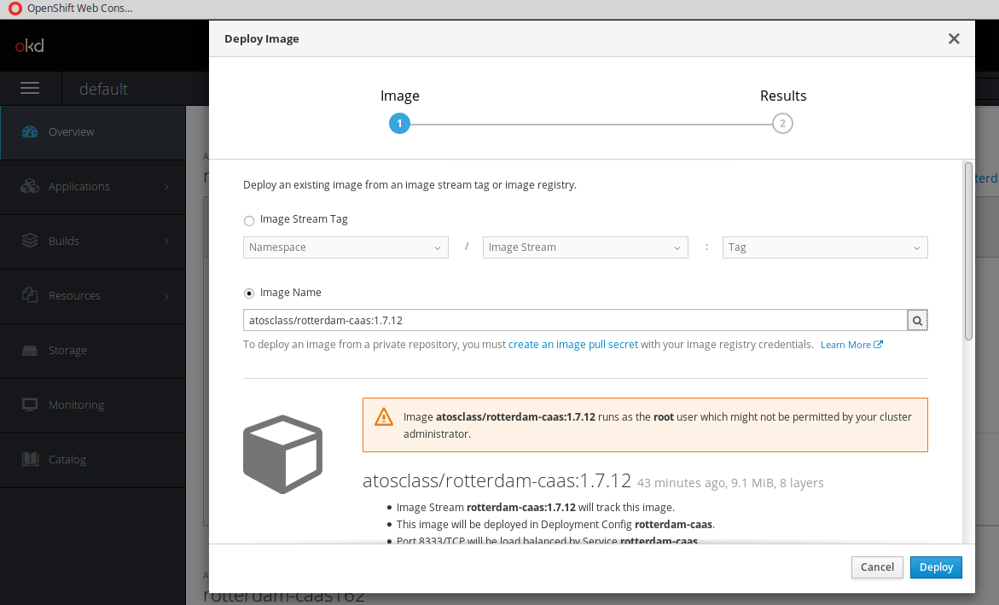
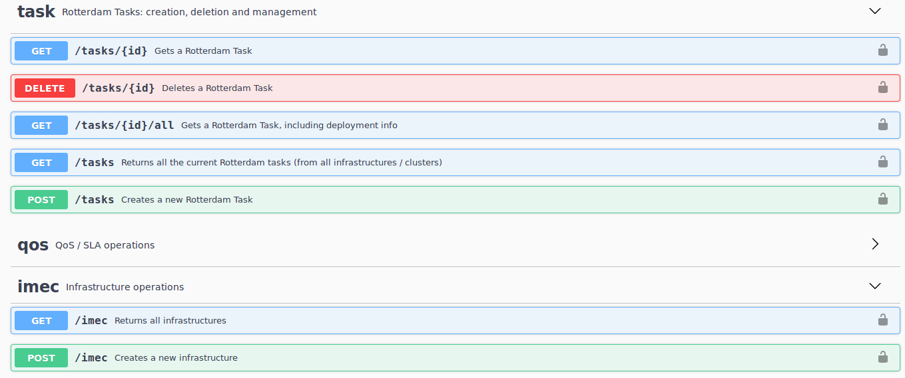

# ROTTERDAM CAAS

#### "ACKNOWLEDGEMENT
#### This work has been supported by the EU H2020 project CLASS, contract #780622."

-----------------------


&copy; Atos Spain S.A. 2018

[](https://www.apache.org/licenses/LICENSE-2.0.html)
[]()


-----------------------

[Description](#description)

[Relation to other CLASS components](#relation-to-other-class-components)

[Installation Guide](#installation-guide)

[Usage Guide](#usage-guide)

[LICENSE](#license)

-----------------------

### Description

**Rotterdam** is a native-cloud Infrastructure-as-a-Service (IaaS) facade which facilitates the deployment and life cycle management of containerized tasks on container orchestration platforms. Its main purpose is to upload, organize, run, manage and stop sets of containers (named tasks) through API calls, and abstract all the resource infrastructure details, even the concept of cluster of machines/instances, to micro-service developers (in the case of [CLASS](https://class-project.eu/), data analytics application/service developers.

Rotterdam is part of the **CLASS** Project (Edge and Cloud Computation: A Highly Distributed Software for Big Data Analytics): https://class-project.eu/


A docker image can be downloaded from https://hub.docker.com/r/atosclass/rotterdam-caas.

-----------------------

### Relation to other CLASS components

This component is used by **COMPSs & DataClay** module to deploy and manage applications in the Cloud and Edge platform manager by Rotterdam.

-----------------------

### Installation Guide

#### Requirements

- Docker (https://docs.docker.com/install/)
- Kubernetes (https://kubernetes.io/docs/setup/) / MicroK8s (microKubernetes) (https://microk8s.io/) / Openshift-OKD (https://docs.okd.io/latest/install/index.html)

#### Installation

- You can download the repository and create the docker image:

    ```bash
    sudo docker build -t rotterdam .
    sudo docker run -p 8333:8333 rotterdam
    ```

- You can also run **Rotterdam** in Docker by pulling the image from Docker Hub:

    ```bash
    docker pull atosclass/rotterdam-caas:1.7.9
    docker run [OPTIONS] atosclass/rotterdam-caas:1.7.9 [COMMAND] [ARG...]
    ```

- Finally, to run **Rotterdam** in Openshift, deploy the [image](https://hub.docker.com/r/atosclass/rotterdam-caas) from Docker Hub using the OKD UI. The following environment variables can be defined:

    - **KubernetesEndPoint** (e.g.) "http://192.168.7.28:8001"
    - **OpenshiftEndPoint** (e.g.) "https://192.168.7.28:8443"
    - **ServerIP** (e.g.) "192.168.7.28"
    - **OpenshiftOauthToken** (e.g.) "eyJhbGciOiJSUzI1 ... 3MiOiJrdWJlcm5ldGVzL3Nlc"
    - **SLALiteEndPoint** (e.g.) "http://rotterdam-slalite.192.168.7.28.xip.io"
    - **PrometheusPushgatewayEndPoint** (e.g.) "http://pushgateway.192.168.7.28.xip.io"

    The **SLALiteEndPoint** is used to automatically generate SLAs and to stop or terminate them. The SLALite component should also point to Rotterdam to send it the violations.

    1. In OKD Web UI, go to selected project / namespace, i.e. the _default_ namespace, and select `Add to project > Deploy Image`
	   
		
    2. Select `Image Name`
        - `atosclass/slalite:1.7.9`
          - Name: `rotterdam-slaliteXXX`
          - Environment Variables: `UrlPrometheus`, `UrlRotterdam`, `MetricsPrometheus`
        - `atosclass/rotterdam`
          - Name: `rotterdam-caasXXX`
          - Environment Variables: `OpenshiftOauthToken`
    3. Deploy
    4. Go to new application / deplopyment and select `Create Route`
        - SLALite - Hostname: `rotterdam-slalite.192.168.7.28.xip.io`
        - Rotterdam - Hostname: `rotterdam-cass.192.168.7.28.xip.io`

##### Configuration file

Example:

```json
{
    "CaaSVersion": "1.7.1",
    "RulesEngineVersion": "1.0.2",
    "RestApiVersion": "1.7.1",
    "IMECVersion": "0.0.3",
    "SLALiteVersion": "0.6.13",
    "ServerPort": 8333,
    "Clusters": [{
        "ID": "maincluster",
        "Name": "Default",
        "Description": "Main cluster",
        "Type": "Openshift",
        "KubernetesEndPoint": "http://192.168.7.28:8001",
        "OpenshiftEndPoint": "https://192.168.7.28:8443",
        "HostIP": "192.168.7.28",
        "OpenshiftOauthToken": "aeeyJhbGciOi32JSUzI1NiIs....5VeNb12oaV7Iwzx",
        "SLALiteEndPoint": "http://rotterdam-slalite.192.168.7.28.xip.io",
        "PrometheusPushgatewayEndPoint": "http://pushgateway.192.168.7.28.xip.io"
    },
    {
        "ID": "microk8s_1",
        "Name": "microk8s_1",
        "Description": "microk8s in Edge device",
        "Type": "microk8s",
        "KubernetesEndPoint": "http://192.168.1.34:8001",
        "HostIP": "192.168.1.34",
        "SLALiteEndPoint": "http://192.168.1.34:8090",
        "PrometheusPushgatewayEndPoint": "http://pushgateway.192.168.7.28.xip.io",
        "User": "vagrant",
        "Password": "vagrant",
        "HostPort": 22
    }],
    "SLAs": {
        "CreationDate": "2019-01-01T00:00:00Z",
        "ExpirationDate": "2024-01-01T00:00:00Z"
    },
    "Tasks": {
        "MaxReplicas": 30,
        "MinReplicas": 1,
        "MaxAllowed": 2,
        "ScaleFactor": 1.25,
        "Value": 2,
        "Comparator": "<",
        "Action": "scale_out"
    }
}
```

##### Dockerfile

```bash
##########################################
FROM golang:alpine as builder

RUN apk add --no-cache git curl

RUN curl https://raw.githubusercontent.com/golang/dep/master/install.sh | sh

WORKDIR /go/src/atos/rotterdam

COPY . .

RUN go get -d -v ./...
RUN CGO_ENABLED=0 GOOS=linux go build -a -o Rotterdam .

##########################################
FROM alpine:3.6
WORKDIR /opt/rotterdam

COPY --from=builder /go/src/atos/rotterdam/Rotterdam .
COPY run_rotterdam.sh run_rotterdam.sh
COPY ./config/config.json ./config/config.json
COPY ./config/qos_templates.json ./config/qos_templates.json
COPY ./rest-api ./rest-api

RUN chmod 775 /opt/rotterdam/run_rotterdam.sh

EXPOSE 8333
ENTRYPOINT ["/opt/rotterdam/run_rotterdam.sh"]
```


-----------------------

### Usage Guide

Once **Rotterdam** is deployed, you can access it through the REST API UI provided by _swagger_: (e.g.) http://rotterdam-caas.192.168.7.28.xip.io/swaggerui/



The following methods have been defined:

- To get information about Rotterdam or the selected orchestrator
  - **GET** /api/v1/config
  - **GET** /api/v1/version
  - **GET** /api/v1/status
  - **GET** /api/v1/caas/config
  - **GET** /api/v1/rules-engine/config
- The following method is used by the **SLALite** component to send Rotterdam violations and notifications
  - **POST** /api/v1/sla/tasks/{name}/guarantee/{guarantee}
- To get all running tasks
  - **GET** /api/v1/tasks
- To create a new tasks in Rotterdam
  - **POST** /api/v1/tasks
- To view / manage tasks
  - **GET** /api/v1/tasks/{name}
  - **DELETE** /api/v1/tasks/{name}
- QoS templates
  - **POST** /api/v1/qos/definitions  (creates a new QoS template)
  - **GET** /api/v1/qos/definitions
  - **GET** /api/v1/qos/definitions/{name}
	
#### Default task definition examples

```json
{
    "name": "adas-my-nginx",
    "dock": "default",
    "qos": {
      "name": "KubeletTooManyPods",
      "description": "scale down task if cluster pods > 20",
    },
    "replicas": 10,
    "containers": [{
      "name": "adas-my-nginx-app",
      "image": "nginx",
      "ports": [
          {
            "containerPort": "80",
            "hostPort": "80",
            "protocol": "tcp"
          }
        ],
      "volumes": [
        {
          "name": "PATH",
          "mounthPath": "/usr/share/class/vol/"
        }],
			"environment": [
				{
					"name": "TEST_VAL",
					"value":"1.2.3"
				}
			]}
    ]
}
```

```json
{
  "name": "redis-app-2",
  "dock": "class",
  "qos": {
    "name": "KubeletTooManyPods",
    "description": "scale down task if cluster pods > 20"
  },
  "replicas": 4,
  "containers": [
    {
      "name": "redis",
      "image": "redis",
      "ports": [
        {
          "containerPort": 6379,
          "hostPort": 6379,
          "protocol": "tcp"
        }
      ]
    }
  ]
}
```

#### COMPSs task definition example

```json
{
	"name": "redis-app",
	"replicas": 4,
	"image": "redis",
	"qos": [{"qosid": "deadlines001", "metric": "missed_deadlines_001", "comparator": "=", "value": 35, "action": "scale_out", "maxreplicas": 25, "minreplicas": 2, "scalefactor": 1.5, "maxallowed": 2}],
	"ports": [6379]
}
```


#### Predefined QoS

QoS templates used to define the SLAs associated to the tasks managed by Rotterdam.

| QoS                         | description | description                                       | source, job       |
|-----------------------------|-------------|---------------------------------------------------|-------------------|
| **KubeletTooManyPods**      | infra       | scale down task if total of cluster pods is > 20  | Prometheus - kubernetes-nodes-cadvisor |
| **KubeletPodsLessThan100**  | infra       | scale down task if total of cluster pods is > 100 | Prometheus - kubernetes-nodes-cadvisor |
| **KubeletPodsMoreThan100**  | infra       | scale up task if total of cluster pods is < 100   | Prometheus - kubernetes-nodes-cadvisor |
| **Test_Prometheus_01**      | infra       | force a task to be scaled up                      | Prometheus - kubernetes-nodes-cadvisor |

1. `KubeletTooManyPods`:

    ```json
    {
        "qos": {
          "name": "KubeletTooManyPods",
          "description": "scale down task if cluster pods > 20"
        }
    }
    ```

    _KubeletTooManyPods_ QoS is equivalent to the following:

    ```json
    "custom": [{
        "guarantees": [{"metric": "kubelet_running_pod_count", "condition": "<", "value": "50"}],
        "action": "scale_down",
        "scalefactor": 2,
        "max": 30,
        "min": 1,
        "type": "infr",
        "name": "cluster_pods_less_50",
        "description": "scale down task if cluster pods > 50"
    }]
    ```

2. `Test01`:

    ```json
    {
        "qos": {
          "name": "Test_Prometheus_01",
          "description": "scale up task if go_memstats_frees_total metric is less than 500000"
        }
    }
    ```

---------------------------------

### LICENSE

`Rotterdam` is licensed under [Apache License, version 2](LICENSE).
